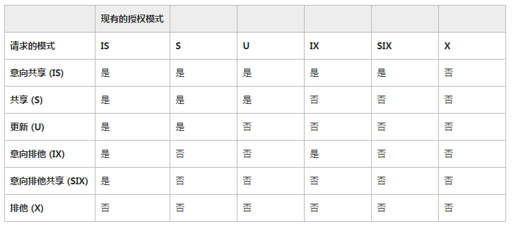

##SQL SERVER性能调优实践

### 执行计划
1. 如何查看执行计划
1. 如何优化查询计划
1. 查看索引缺失

###　高性能的SQL
1. `in`/`exists` 最终将转换为join
1. 尽量使用索引作为查询条件
1. `where`条件中对索引使用函数或者计算，将无法使用索引，可以使用计算索引替代
1. 使用小表驱动大表 - 记录少的`join`记录多的表
1. index seek **>>>** index scan **>>>** table scan
1. 字段合并使用`for xml path('')`
1. 排序和分组都将使用排序函数，临时数据存到`tempdb`中，IO增加耗时
1. 只查出需要的字段，避免使用`select * from`
1. `distinct`其实就是全列的`group by`
1. `update`先使用更新锁找到需要更新的数据，然后使用排它锁更新数据，**死锁的重头戏**
1. 清空数据表的时候使用`truncate table`替代`delete table`，truncate会重置identity，并且不会记录日志，delete则会记录大量的删除日志
1. 子查询尽量出现在`where`条件中
1. 子查询中避免对大数据进行汇总和排序操作
1. 子查询返回尽量少的记录
1. 子查询尽量使用确定性的判断，如=，in，exists等，避免使用any，some或all

### 子查询
子查询会被转换为连接操作，但是复杂的子查询可能不会转化为连接，这个时候子查询会被**优先执行**，其结果作为下一个操作的输入部分。

### merge操作
一个语句中实现数据的insert和update

### for xml path('')
高性能的字段合并
```
/*for xml path输出自定义的列名比较麻烦，下面这个写法完美破解*/
declare @names varchar(max) = ''
select @names = (
    select A.name+',' from users as A
    for xml path('')
)
select names = @names
```


### 索引类型
1. 聚集索引
1. 非聚集索引
1. 单列索引
1. 唯一索引
1. 包含索引
1. 覆盖索引
1. 计算索引
1. 条件索引
1. 视图索引
1. 表变量索引(只能在创建是添加)
1. 临时表索引

### tempdb
1. 临时表和表变量都是存储在tempdb中，事务结束后删除
1. 一个\#开头的是局部临时表，当前事务可见
1. 两个\#开头的是全局临时表，事务未结束时其他事务可见

### 读写分离
1. 读写分离实例，如何配置
1. HA(高可用性)和Always on如何将读写数据库复制到只读数据库
   2012中引入的Always on解决了HA复制的只读库还原后无法读取的问题

### 性能监控
利用SQL SERVER的代理服务可以实现：

1. 定时任务，如周期性备份
1. 性能警报

利用代理监控死锁，email发送死锁上下文，执行缓存信息

### 性能条件警报配置：


### 锁兼容性
https://msdn.microsoft.com/zh-cn/library/ms186396.aspx


更新操作中如果一行数据被加更新锁，其他的事务想通过表扫描查找这条记录之后的行时就会出现等待